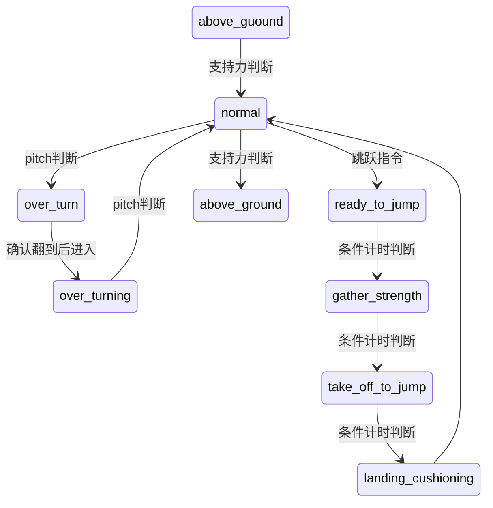

# 轮腿机器人控制代码

## 模式切换FSM

```mermaid
stateDiagram-v2
	normal --> over_turn :pitch判断
	normal --> ready_to_jump : 跳跃指令
	normal --> above_ground : 支持力判断
	
	over_turn --> over_turning : 确认翻到后进入
	over_turning --> normal : pitch判断
	
	ready_to_jump --> gather_strength : 条件计时判断
	gather_strength --> take_off_to_jump : 条件计时判断
	take_off_to_jump --> landing_cushioning : 条件计时判断
	landing_cushioning--> normal : 
	
	above_guound --> normal : 支持力判断
```

